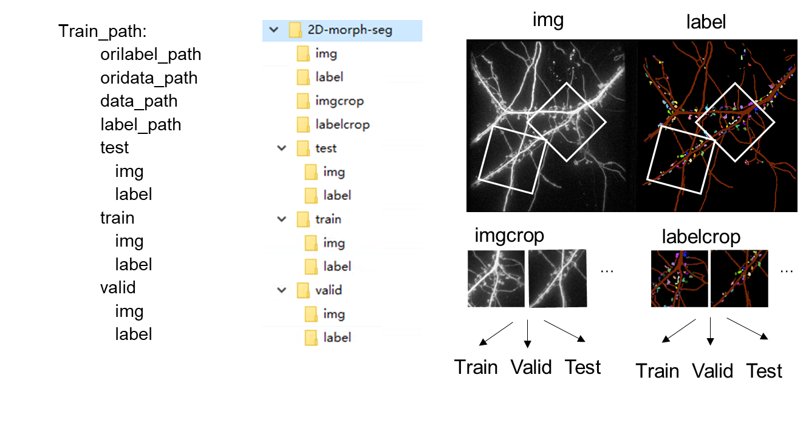

# Introduction
The project provides a set of codes for microscope-fluorescencent neuronal iamges' spine annotation ,deep training (torch) and identification. 
# Directory structure
The code still needs to be cleaned up and optimized. 
The current spine analysis pipeline include two steps:
   1. obtain your labeled dataset by label plugin
   2. training deeplearn network for identifying spine

These two steps correspond to the script folder: `spine-segment-pipeline` and `train` 

After obtaining the spine segment result, you can execute some statistics in `spine-ipynb` (jupyter notebook) or your custom scripts.( **TODO** : user-friendly )

```
1. profile and models
   +---config : parameter profile
   +---models : store default trained model
   +---logdir : store log info
2. scripts
   +---train : store deep-learning scripts
      +---networks : some networks(cnn,unet++,unet2d)
      +---trainers
      |-loss
      |-metrics
      |-trainer
      |-test
      |-predict
      +---transformer : no use
      +---utils
      |-yaml_config : load default yaml profile
      |-file_base
      +---dataset
      |-dataloader: loader data and split data into train/valid/test folder
      |-enhancer: augmentation
      |-localthreshold
   +---spine-segment-pipeline : plugin for napari
   +---spinelib : spine identify lib
   +---spine-ipynb : scripts for spine analysis
```
# Environment requirement

If you want to run tensorflow implement version, you can find it in history version while it will not be updated anymore.

The peocedure had only been tested with **torch-gpu version at windows platform** , other environments profile may encounter some errors which need to be checked and corrected.

**TODO** : requirement.txt(light weight?)

## some environment preparation:

1. conda with python 3.8.6, torch-cuda,  cudnn 

   conda download link:https://docs.conda.io/en/latest/miniconda.html
  
   check your graphic card drive and its cuda version: https://docs.nvidia.com/cuda/cuda-toolkit-release-notes/index.html

   cuda cudnn download link:https://docs.nvidia.com/deeplearning/cudnn/support-matrix/index.html

   torch downloadlink: https://pytorch.org/

2. install packages  , run `pip install -r requirement.txt` in terminal ? . The module 'gwdt' (optional) need be build by yourself ( make sure you have microsoft C++ buld tool and Cpython , just install it like common python package : `python setup.py install`)

   gwdt download link: https://github.com/chunglabmit/gwdt

3. install napari plugin , run `environment_bat.bat’`in terminal
4. vscode  with python extension(optional):

   vscode download link : https://code.visualstudio.com/

**environment install bat:**
```cmd
conda create -n pyspine python=3.8.6  pip=22.3.1 :: spineanpyspinealysis is name of virtual environment ,can set others
conda activate pyspine :: enter virtual environment
pip install -r requirement.txt
environment_bat.bat
```
# Test Data

## demo dataset download link: 

download dataset and move my-dataset to the program folder.
https://www.jianguoyun.com/p/Dcha3qUQ297KCxjPmIIFIAA (password：please contact us , data isn't mine), include:

1. dataset :
   1. crop imgs (npy.npz) for SVM/CNN classifier training
   2. img and pixel-labels for Unet training
   3. test image data for label plugin
2. configure file: yaml files
3. trained model : SVM, CNN , Unet2d model
   * SVM , *.pickle
   * CNN , *.pt
   * UNet model : 
      * *.pth store static_dict for training
      * *pt store whole model for predict plugin

   

# Simple usage

## Part1 : prepare annotation dataset (label plugin)

You can obtain custom dataset by `napari` or any other methods. 

If you choose `napari`, here we provide a napari plugin for preparing annotation dataset. 

you can run `napari` in terminal or run `0napari_viewer.py` to open napari,click pluin -> spine-segment-pipeline will see widgets. The plugin usage see:

 [spine-segment-pipeline pluin usage](/spine-segment-pipeline)


## Part2 : train your dataset

### 2.1 Train SVM/CNN for spine seed detector:

obtain crop image by label plugin and train data by 
1. `spine-ipynb\train_ball_line_cnn.ipynb` and 
2. `spine-ipynb\train_ball_line_svm.ipynb` scripts.

### 2.2 Train Unet Semantic Segmentation network:

**require the YAML file to be configured first**, some yaml examples are provided in config folders 

**TODO**: yaml file paramenters interpretation

1. data preparation :


2. run 1dataset_script.py  to get dendrite+spine labels, croped imgs/labels,and split to train,test,valid data


3. run 2train_script.py to train network

4. predict img and save result

   You can use (1) **napari plugin** or (2) **ipynb script** to process image data

   1. [use napari plugin](/spine-segment-pipeline)


   2. use ipynb scripts in spine-ipynb folder

      “object_and_track.ipynb” script in spine-ipynb folder , and each code block has a brief introduction
## Part 3 (optional)   
1. transform roi to to imageJ roi file format : use [LabelsToROIs](https://labelstorois.github.io/) plugin \: 
2. ipynb script

   these haved been checked. 
   - [x] spine-ipynb\single_frame_2D_3D_by_model.ipynb
   - [x] spine-ipynb\single_frame_2D_3D_statics.ipynb
   - [x] spine-ipynb\train_ball_line_cnn.ipynb
   - [x] spine-ipynb\train_ball_line_svm.ipynb

# TODO

1. Only culture data under confocal microscopy have been tested so far (pixel size : 0.16um*0.16um xy , z space 0.1um, thick <3 um, data with larger pixel spacing may not be applicable and needs to be optimized ). Try more data

2. try instance segment network

3. ......

# File description

1. anotation data

   include images and their labels, file suffix .tif

   data is in Train folder,include these subfolders:

   1. img : whole original image
   2. label :  whole original image’ label
   3. imgcrop: crop img from img folder
   4. labelcrop: crop label from label folder
   5. train+test+valid : split data from crop folder

   image data suffix :

   1. None : origin image 
	2. den :	backgound:0	, dendrite=1	, no spine
	3. spine :	backgound:0	,no dendrite	,spine : 1~N
	4. mask : 	backgound:0	,dendrite:1	,spine=2
	5. seg :	backgound:0	,dendrite:1	,spine : 2~N+1
    6. npy.npz : crop image for [training spot detecter](../)

2. model data

   weight model (unet) : XXX .pth

   svm model : XXX .clk

   cnn model : XXX .pth

3. log data

   1. model_info.log              : some execution records
   2. error log                   : excution error records

4. config file (.YAML)

```yaml
Path:
   # datset folder and model/log save folder
   Train_path: E:\data\Train\Train/2D-2023-seg/ # dataset root folder

   oridata_path: "" #  defalt  Train_path/img    store large img 
   orilabel_path: "" # defalt  Train_path/label  store label for img 
  
   data_path: "" #  defalt Train_path/imgcrop    store small img 
   label_path: "" # defalt  Train_path/labelcrop will crop from whole img 

   log_path: "../test-dataset/log/2Dtorchunetpp2/seg/"  #  defalt Train_path/log error tensorboard score log dir
   model_path : "../test-dataset/model/2Dtorchunetpp2/seg" #  defalt  Train_path/model
   model_save_path: "../test-dataset/model/2Dtorchunetpp2/seg/best.pth" # no use
 
   save_suffix: "-seg"  # see image data suffix
   label_suffix: "-seg"
  filetype: ".tif"
Data:
   # image data info, like dimension, image size, class num, split proportion ....
Network:
   # network parameters, use what network
Training:
   # trian profile, like optimizer, loss func ...
  
```

The picture illustrates each path' data type, you can run `1dataset_script.py` to obtain crop data and split crop date into train/valid/test folder. Train step will load data from train and test folder.



# Upgrade information

20230427
1. fix bug: napari pluin run at current folder only -> also other folder, by `torch.jit`
2. add another instance segment stratage, by backgournd threshold.
3. show error information when load model raise Error.
4. provide two ways for spliting datset : 1. split ori-image first then crop data (1-1dataset_scipt.py), 2. crop data first then split crop data to tran/valid/test(1-2dataset_scipy.py). 


# history readme 

0. anotation ,plugin include “label”and “time” widget

   you nedd install [spine-segment-pipeline pluin](/myspine/spine-segment-pipeline)
1. set yaml config profile

   **change utils.yaml_config.py `default_configuration` path**

   You must configure it first, otherwise none of the subsequent steps will run. Some ref yaml profile templates in config folder
2. image augmentation

   **run python dataset/enhander.py**

   will crop ori image and label from `oridata_path` and `orilabel_path` into size of (`input_sizez`,`input_sizexy`,`input_sizexy`) and store in `data_path` and `label_path` respectively. when stroed in lebel_path, filename will end with `label_suffix`.

   if use `unet` Trainning model , interger instance label will all set 2, dendrite set 1, background set 0.

   if use other : todo

   would get (iter *number of oriimgs) new crop imgs. so you need set iter according to your dataset size
3. split dataset into train and test

   **run python dataset/dataloader.py**

   script will split data into three part: train , valid, test accoding to user specified `partion` and store in  `Train_path` folder for trainning.

   here only use most simple method -- split img to different folder. ( I want to make tfrecord to increase img load velocity , but tfrecord cannot be read correctly )
4. train model

   **run python trainers/trainer.py**

   if you have pretrained mode, change `premodel` variable in trainer.py to your model path

   LOG :

   1. loss_time folder     : loss value with epoch
   2. model.h5             : weight model
   3. all.log              : some infomation log
   4. error log            : excution error log
   5. events.out.tfevents  : for tensorboard
      ```cmd
      tensorboard --logdir=events.out.tfevents folder
      ```
5. test predict

   **run python trainers/test.py**

   will predict img in test folder, and show img and results.
   You could check model in this way
6. patch process time imgs(jupyter notebook)

   see notebook  in spine-ipynb folder for details
