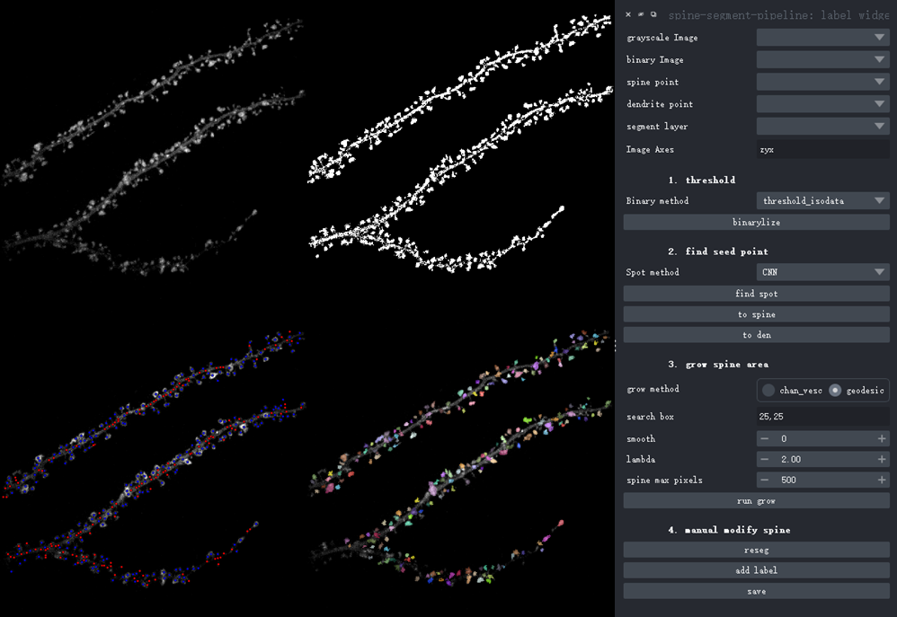
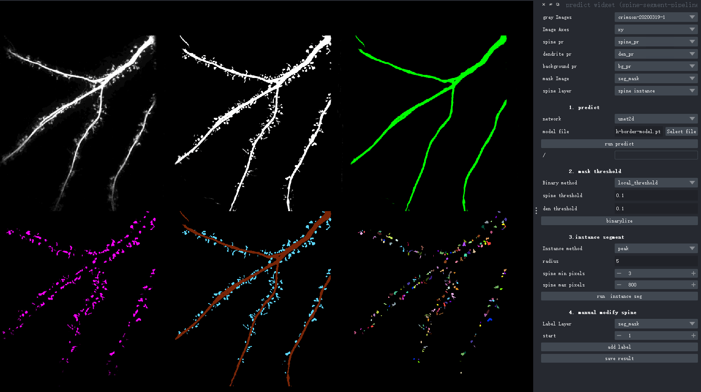

# Installation
Make sure you have install napari first, then:
1. Enter folder: " spine-segment-pipeline "
2. Run : `pip install -e .` in console ( terminal )

If your device doesn't connect the Internet,you could run 

`pip install -e . --no-build-isolation` in console.

The former command will register at python env location, the latter command will register at current folder (not sure)
* dependency modules install

1. some dependency modules are listed in requirement.txt ( higher version also work ? )

2. `GWDT` optional be build by yourself ( make sure you have microsoft C++ buld tool and Cpython )

   gwdt download link: https://github.com/chunglabmit/gwdt

# File structure

napari.yaml : plugin registration information include two widget and two sample data

__dock_widget.py : plugin widget code

_sample_data.py : load sample ( **TODO some path error, don't work** )

# Widgets
1. label widget: process single frame annotation
2. predict widget: process single frame prediction
3. time widget (**TODO**): process multi frames prediction (you can run scripts in ipynb folder for the present)

# Test Data

## note:

I not sure that this plugin is suitable for all data: 
I just try two Neurological researchers's data(one use CaMKII to label Excitatory neuron mophylogy and one use β-Actin to label spine, and pixel resolution of them are all 0.16um/pixel). β-Actin data work better.

## demo dataset download link: 

https://www.jianguoyun.com/p/Dcha3qUQ297KCxjPmIIFIAA (访问密码：need contact us , data isn't mine)

# Function (procedure)
1. binary method for getting neuron morphology contour.
2. give four method to detect spine seed( **TODO** : need to be improved)
1. grow spine area from spine seed with geodesic algorithm and radiation kernel . Binary neuro morph resist its grow progress. (other mehod may work better for your data, I just tested some data)
4. only serve as assist ,some errors need correct by hand

# Usage

## Label widget

1. run napari (enter "napari" in console)- click: plugins → spine-segment-pipeline-label → label widget

2. load 2D/3D one frame img (mot time series), then choose any threshold method (It's up to effect). choose best binary result in `binary Image` combobox.
(you could enable `ridge` to get simple dendrite contour for next spot step)

3. choose spot method. If your data space is not 0.160.16um/pixel, you could only choose "tensor" or "hessian matrix" methods . If you have "SVM/CNN" model , load `model file` ( uploaded to demo dataset) in FileEdit. Then click `find spot`, you will see candidate spots splited into red/blue.
If there are any error spots, choose them and click `to spine` or `to den` to recorrect them. 

4. choose `geodesic` method (another method doesn't work), and enter searchbox size( 3D : z,x,y  2D: x,y), then run `grow`. Of course. You could add missing spots at spine point layer after grow operator.  Then click `reseg`, result will be recaculate based on former result and new points.

5. If some spines have complex shape, and plugin could not identify or segment them correctly.You could modify them manually. click `add label`, plugin reallocate labels for labeled spine, and give new label id for anotation. 

6. `save` button will save dendrite and spine points data, you could run script to train your data. result include : 
    1. img : origin image 
	2. den :	backgound:0	, dendrite=1	, no spine
	3. spine :	backgound:0	,no dendrite	,spine>1
	4. mask : 	backgound:0	,dendrite:1	,spine=2
	5. seg :	backgound:0	,dendrite:1	,spine>2
    6. npy.npz : crop image for [training spot detecter](../)

> another label plugin usage doc :
1. open single image ->  choose one binary method from  “binary method” combobox,click “binarylize”,choose result in ‘binary image’ combobox

2. choose on seed screen method in “spot method” combobox, choose “structure ” or “hessian” method for images of specifically labeled dendritic spines, and choose “SVM” or “CNN” method for iamges of dendritic morphology, choose appropriate spine distance(“radius”), then click “find spot”,will show spine point(blue point mark),and no-spine point(red point mark). choose blue point layer as “spine point” layer,choose red point layer ad “den point” layer.you can delete error point, add misssing point , and move point to den point layer).  move operate will be execute from “to den”(shift +d) and “to spine” (shift+s) button

3. choose “geodesic” grow method,and choose searchbox range (specify zxy for 3d img, or xy for 2d img), click “run grow”, then segment result will appear

5. you can return to setp3 to add/remove/delete point to modify result.when you recorrect points in spine point layer. Then click “reseg” button to see modified result.

6. you can also manually modify the segmentation results on a pixel-by-pixel. Click “add label” ,will assign a new id for painting new spine (will resort id from 1 to maxID, maxID is new id)

7. save spine segment result : Click the "Save" button, select the save directory, and the "grayscale image" and "segmentation layer" will be saved, and 2D cropped image centered on the seed point and the pixel size of the search box. If the image is 3D, two additional results will be saved: z-MIP image and z-MIP segmentation image

8. if you wan to get dendrite segment, this pluin provide single ridge method, click”redge” button.save dendrite segment with format “xxxden.tif”(xxx is grayscale image name)

## Predict widget

1. run napari (enter "napari" in console)- click: plugins → spine-segment-pipeline-label → predict widget

2. choose and load a model file (.pt format) to `predict` dendrite\spine probability maps and get semantic segmentation

3. if you think semantic segmentation is not correct, you can correct this mask result in `mask threshold` step.

4. execute `instance segment`. choose min and max spine pixel size and search radius to get spine individuals.

5. modify spine mannually and save result. result include : 
    1. origin image 
    2. spinepr : spine probability map
    3. denpr : dendrite probability map
    2. den : dendrite mask
    3. spine: spine mask
    4. mask : spine and dendrite semantic segment
    5. seg : dendrite and spine instance segment

## Time widgets (TODO,Bug)

1. you can run `napari` in terminal or run `0napari_viewer.py` to open napari
2. click pluin -> spine-segment-pipeline will see time widget .
3. Open image, choose “unet2d” network and choose trained model(h5). “run predict”  will generate 6 results : dendrite probability, dendritic spine probability ，semantic segmentation result and time-MIP of the above three.
4. Instance segmentation will use spine probability and semantic segmentation, So you need to make sure of correct Instance segmentation.You can modify semantic segmentation in ”3. modify semantic segmentation“. Click ”Single“ wil modify ”semantic segmentation “ and click ”MIP“ will modify ”time-MIP semantic segmentation“. Click “Reset” will reset semantic segmentation.
5. “run instance seg” will get time-MIP instance segmentation based on the time-MIP semantic segmentation result, you can modify this instance segment : delete error spine, modify edge of spine
6. then click “run tracking”will get instance segmentation based on the time-MIP instance segmentation and emantic segmentation result, you can modify this instance segment : delete error spine, modify edge of spine
7. save result: A total of ten images from the “single” and “mip” groups will be saved (binary image will not be save , origin gray iamge will be save)

# TODO

1. Bug:?
2. time-widget 
4. Improve execution speed?
5. use other segment methods?
4. support low resolusion flurescent neuron morph or spine label images (test data is 0.16um/pixel) , supersolusion not support . improve label plugin to support more neuron data ( high resolution ?, like imaris method ?)
5. sample data Bug

# GUI screenshot

