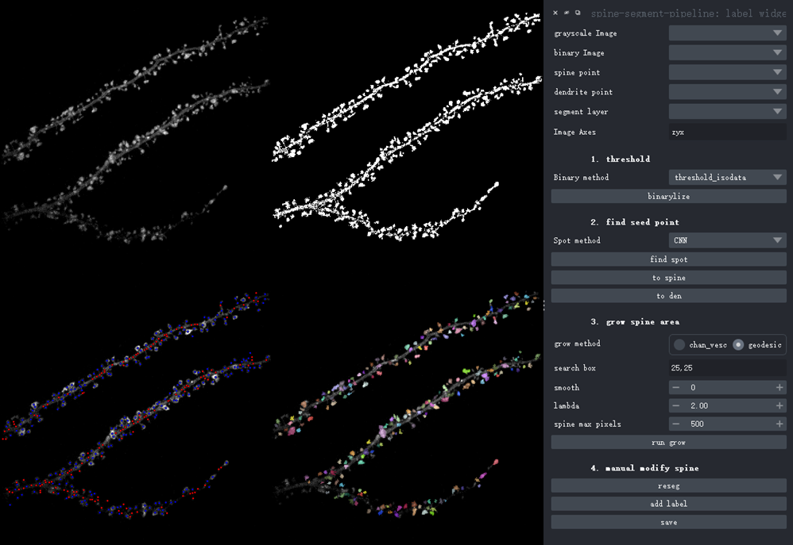

# installation

1. enter folder: " spine-segment-pipeline "
2. run : pip install -e . in command

# file structure

napari.yaml : plugin registration information include two widget and two sample

__dock_widget.py : plugin widget code

_sample_data.py : load sample

# GUI screenshot

# func 
1. set spine point and grow spine area with geodesic algorithm and radiation kernel . Binary neuro morph resist its grow border.
2. give four method to detect spine
3. geodesic and chan vese method to get spine contour
4. only serve as assist ,some errors need correct by hand
5. 
# TODO

1. Bug: CNN model only support jupyter launch mode not command line 
2. time-widget 
3. export result function
4. support low resolusion flurescent neuron morph or spine label images (test data is 0.16um/pixel) , supersolusion not support 
5. sample data 